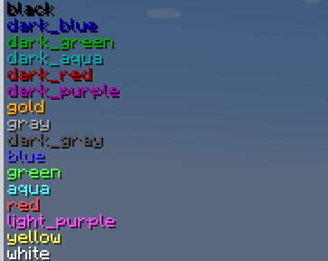

# All Death Messages

## Overview
Enables death messages for any entity you want.

Specific categories of mobs can be defined in a config file, and their names in the messages can be styled with different colours and effects.

For each category, separate `kill` and `death` gamerules are generated.

## Message Triggers

There is a handful of built-in categories based on mob preoperties, and custom ones can be created in the config based on entity types.

A mob may belong to multiple categories; it will trigger a death message if any of them has its rule enabled.

### Built-in categories
- `all`: Applies to everything. When enabled, this overrules all other categories.
- `named`: Mobs that have been given a custom name, including all players.
- `persistent`: Mobs that will not naturally despawn.
- `ephemeral`: The negation of `persistent`
- `hostile`: Mobs treated as hostile by the game's code.
- `passive`: Mobs treated as passive by the game's code. This is _not_ the negation of `hostile`; some mobs are neither hostile nor passive.

### Custom categories
Custom categories are defined in `.minecraft/config/alldeath-rules.json`.

Each key in the root object is used as a category name. The associated value is an array of strings, representing the entity types that can trigger the gamerule.

This example is provided as the default config file:
```json
{
	"utility": [
		"minecraft:allay",
		"minecraft:iron_golem",
		"minecraft:villager",
		"minecraft:wandering_trader"
	],
	"boss": [
		"minecraft:ender_dragon",
		"minecraft:elder_guardian",
		"minecraft:warden",
		"minecraft:wither"
	]
}
```

## Name Styling

Mob names in death messages can have different colours and styling applied. Those styles can be based on same categories used in gamerules (both built-in and user-defined), but can also be independent from them. They can define anonymous categories which do not match any gamerule.

When multiple styles match a mob, they will all be combined. Where properties conflict, the topmost style takes priority over the lower ones.
Multiple styles can be created for the same category, allowing different style properties to have different priorities.


Styles are defined in the config file `.minecraft/config/alldeath-styles.json`, as an array of Json Object.  
Each object may contain the following properties:
- _(Mandatory)_ `rule`: The mobs that will have the style applied
	- If it is a string, it will be treated as the name of a gamerule.
	- If it is an array of strings, it will be treated as a list of entity types, similar to how gamerules are defined.
- _(Optional)_ `color`: A string. Can be either a hex code formatted as `#rrggbb`, or a built-in colour name.
- _(Optional)_ `bold`: A boolean
- _(Optional)_ `italic`: A boolean
- _(Optional)_ `underline`: A boolean
- _(Optional)_ `strikethrough`: A boolean
- _(Optional)_ `obfuscated`: A boolean

  


### Styling Example
```json
[
	{
		"rule": [
			"minecraft:player"
		],
		"color": "yellow",
		"italic": false,
	},
	{
		"rule": "named",
		"italic": true,
		"underline": true
	}
]
```

The topmost style defines an anonymous category for entities of type "player". The bottom one refers to the built-in "named" category.

Players also belong to the "named" category, so both styles will be applied to a Player's name:  
The "italic" property is taken from the topmost style; player names will not be italicized.  
The topmost style does not define a "underline" property, so the lower property is used, and player names will be underlined.

## Commands

`/alldeathmsg` is the root for all subcommands. It requires a permision level of at least 2.

- `test <entities>` Checks which rules apply to the given entities, and preview their styled names.
- `see-enabled` Lists all currently enabled rules
- `disable-all <confirm>` Disables all death message rules.
- `set <rule name> <rule type> <boolean>` Equivalent to the `gamerule` command, but with a more convenient auto-complete.
